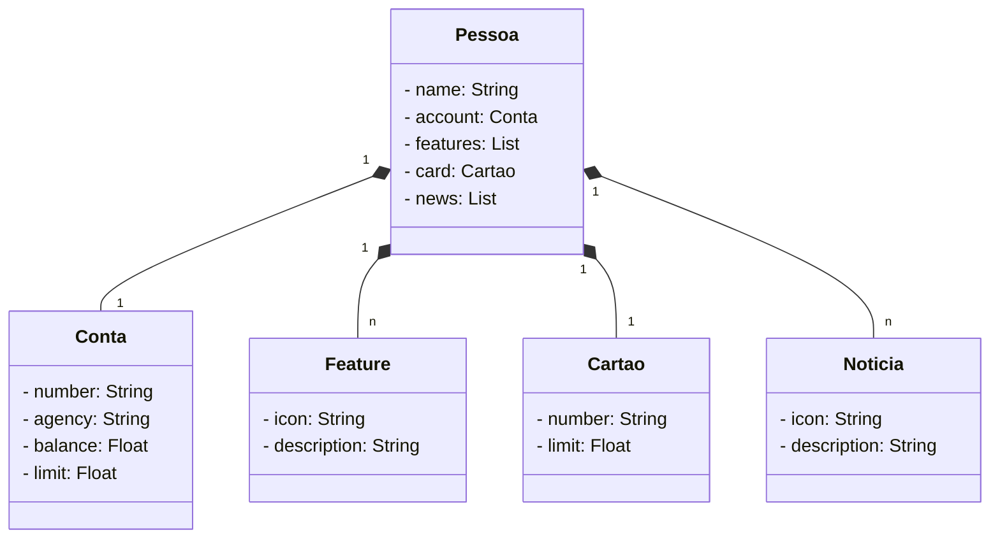

# Java-Santander-dev-week
Desafio proposto pela DIO durante a Santander Dev Week 2023

## Diagrama de Classes

```mermaid
classDiagram
  class Pessoa {
    - name: String
    - account: Conta
    - features: List<Feature>
    - card: Cartao
    - news: List<Noticia>
  }
  class Conta {
    - number: String
    - agency: String
    - balance: Float
    - limit: Float
  }
  class Feature {
    - icon: String
    - description: String
  }
  class Cartao {
    - number: String
    - limit: Float
  }
  class Noticia {
    - icon: String
    - description: String
  }

  Pessoa "1" *-- "1" Conta
  Pessoa "1" *-- "n" Feature
  Pessoa "1" *-- "1" Cartao
  Pessoa "1" *-- "n" Noticia


```
